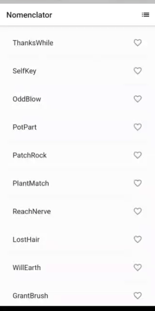

# Nomenclator

One of my first projects in Flutter. I created this with the help of [Google Codelabs](https://codelabs.developers.google.com/codelabs/first-flutter-app-pt1). It doesn't do much, but is a good starting app to learn Flutter.

This year, the same codelab was also featured in [Google I/O 2021](https://events.google.com/io/).

## About the App

A simple mobile Flutter app that generates proposed names which can be used for anything. The user can select and unselect names, saving the best ones. The code lazily generates 10 names at a time. As the user scrolls, more names are generated. There is no limit to how far a user can scroll.

Here is a demo of the app:

